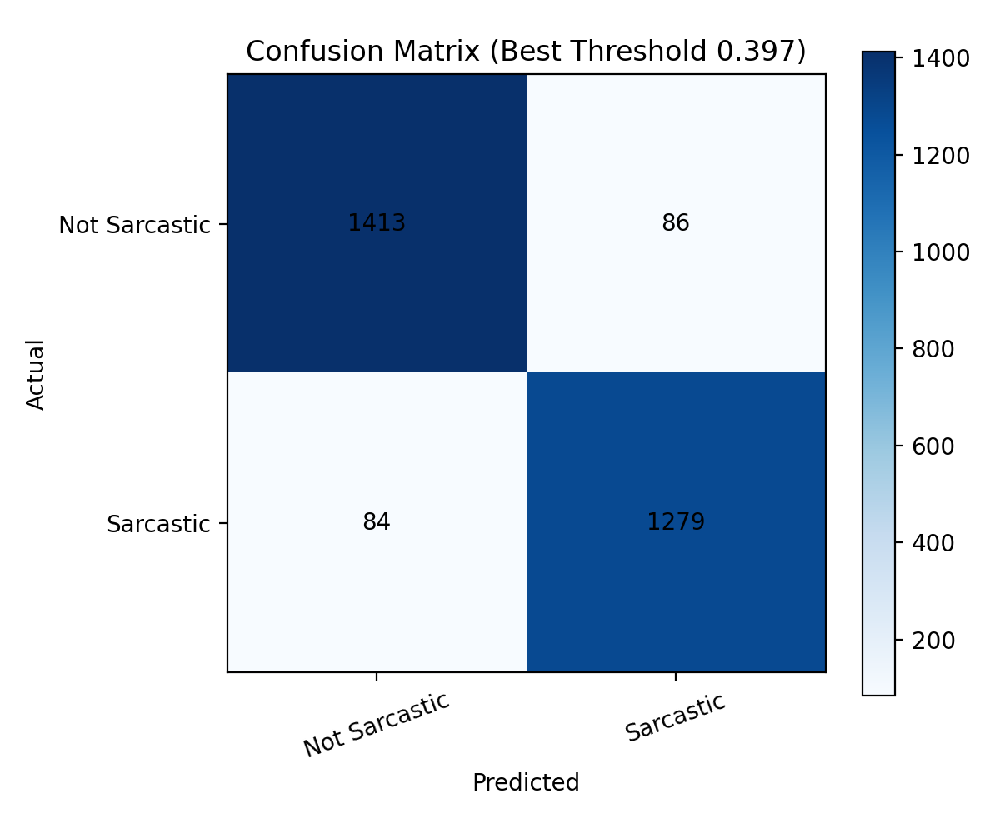
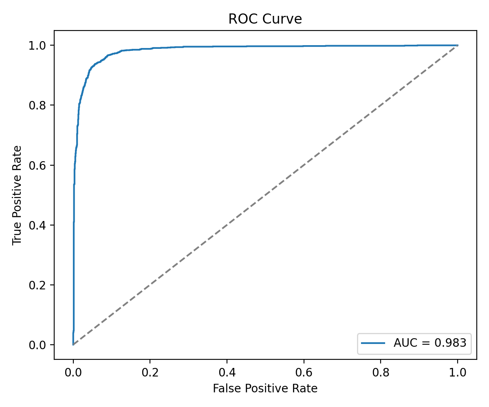
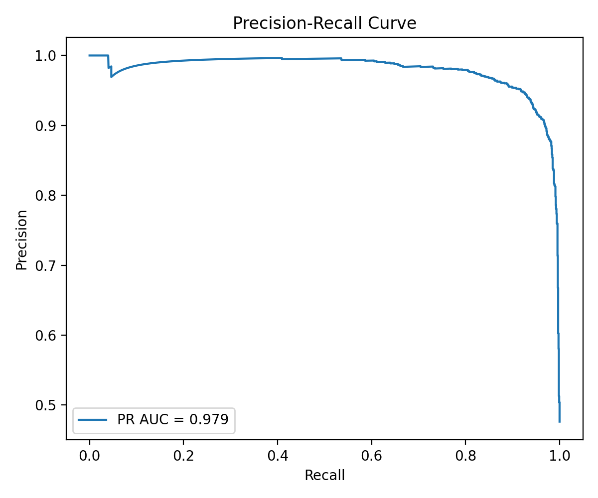
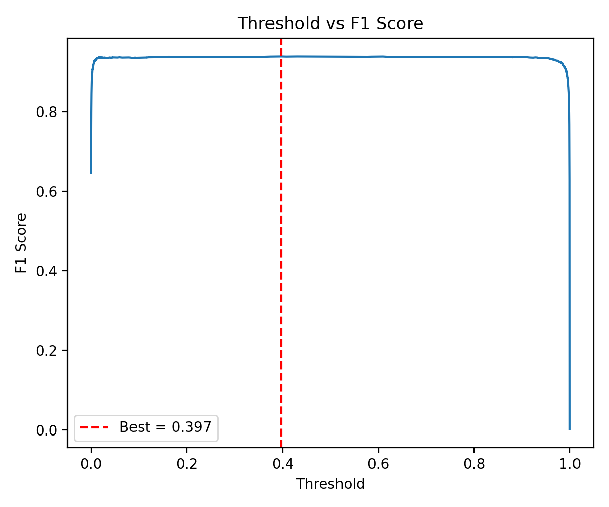
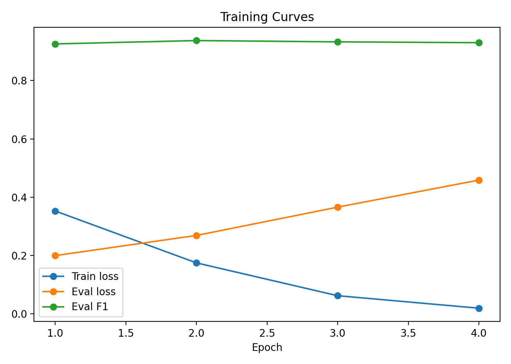
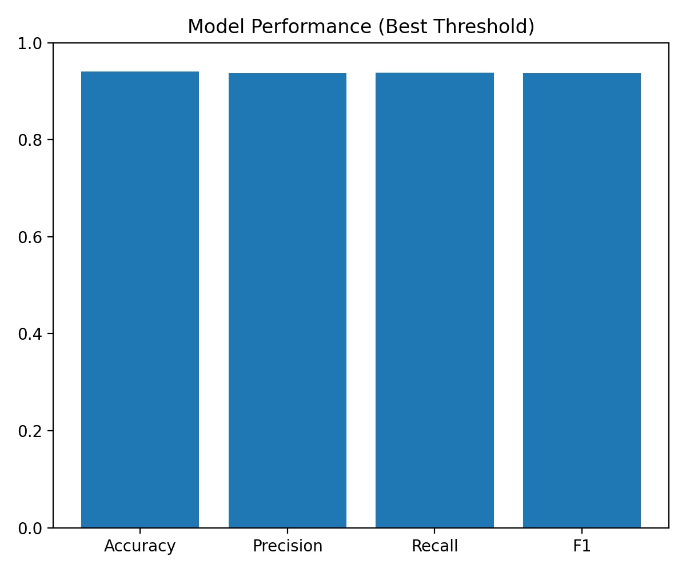

# Sarcasm Detection in News Headlines Using BERT

<p align="center">
  
</p>

A transformer-based sarcasm detection system that classifies news headlines as **sarcastic** or **not sarcastic** using a fine-tuned BERT model. The project includes model training, evaluation artifacts, a FastAPI backend, and a browser-based user interface for real-time predictions.

Repository: [hxmz-axfn07/sarcasm-detection-bert](https://github.com/hxmz-axfn07/sarcasm-detection-bert)

---

## Table of Contents

- [Overview](#overview)
- [Features](#features)
- [Tech Stack](#tech-stack)
- [Repository Structure](#repository-structure)
- [Model Details](#model-details)
- [Performance](#performance)
- [Dataset](#dataset)
- [Installation](#installation)
- [Running the Application](#running-the-application)
- [API Usage](#api-usage)
- [Training the Model](#training-the-model)
- [Evaluation Artifacts](#evaluation-artifacts)
- [Limitations](#limitations)
- [Future Improvements](#future-improvements)
- [Acknowledgements](#acknowledgements)

---

## Overview

Sarcasm is difficult for natural language processing systems because the intended meaning of a sentence can be opposite to its literal wording. This project addresses that problem by fine-tuning `bert-base-uncased` for binary text classification on headline-style sarcasm data.

The system is designed to:

- classify input text as sarcastic or not sarcastic
- return a confidence score based on model probability
- expose predictions through a FastAPI endpoint
- provide a simple browser UI for testing headlines and short sentences
- generate evaluation plots such as confusion matrix, ROC curve, PR curve, threshold-vs-F1 curve, and training curves

---

## Features

- Fine-tuned BERT model for sarcasm detection
- Binary classification: `sarcastic` vs `not_sarcastic`
- Weighted loss during training to reduce class imbalance impact
- Stratified train/test split for stable evaluation
- Threshold optimization based on F1-score
- FastAPI backend with `/predict` endpoint
- Browser-based frontend in `frontend/index.html`
- Confidence score, explanation, and tags in API response
- Saved evaluation reports and plots
- Git LFS support for large model weights

---

## Tech Stack

| Area | Tools |
| --- | --- |
| Language | Python, HTML, CSS, JavaScript |
| Model | BERT Base Uncased |
| ML Framework | PyTorch, Hugging Face Transformers |
| Dataset Handling | pandas, Hugging Face Datasets |
| Metrics | scikit-learn |
| Visualization | matplotlib |
| Backend | FastAPI, Uvicorn |
| Frontend | Static HTML/CSS/JavaScript |
| Model Storage | Hugging Face model files, Git LFS |

---

## Repository Structure

```text
.
├── src/api.py
├── src/train.py
├── src/inference.py
├── frontend/index.html
├── models/final_model/
│   ├── config.json
│   ├── model.safetensors
│   ├── tokenizer.json
│   ├── tokenizer_config.json
│   ├── special_tokens_map.json
│   └── vocab.txt
├── results/final_metrics.json
├── results/training_log.csv
├── assets/confusion-matrix.png
├── assets/confusion-matrix-default-threshold.png
├── assets/roc-curve.png
├── assets/pr-curve.png
├── assets/threshold-vs-f1.png
├── assets/training-curves.png
├── assets/model-performance.png
├── bert_final_training.ipynb
├── inf.ipynb
├── .gitattributes
├── .gitignore
└── README.md
```

### Key Files

| File | Purpose |
| --- | --- |
| `src/train.py` | Full model training and evaluation script |
| `src/inference.py` | Loads the saved model and runs single-text inference |
| `src/api.py` | FastAPI backend for serving the model and UI |
| `frontend/index.html` | Browser-based sarcasm detector UI |
| `models/final_model/` | Saved BERT model and tokenizer files |
| `results/final_metrics.json` | Final evaluation metrics and threshold information |
| `results/training_log.csv` | Training/evaluation logs exported from Trainer |
| `*.png` plots | Evaluation and training visualizations |

---

## Model Details

| Property | Value |
| --- | --- |
| Base model | `bert-base-uncased` |
| Task | Binary text classification |
| Classes | `0 = not sarcastic`, `1 = sarcastic` |
| Maximum sequence length | 128 tokens |
| Train/test split | 90 percent / 10 percent |
| Random seed | 42 |
| Training epochs | 4 |
| Learning rate | `2e-5` |
| Batch size | 8 |
| Loss function | Weighted cross-entropy |
| Best threshold | `0.3965` from F1 optimization |

The training script uses a custom `WeightedTrainer` class to apply class weights during loss calculation. This helps the classifier avoid favoring one class when the dataset distribution is not perfectly balanced.

---

## Performance

Evaluation results from `results/final_metrics.json`:

| Metric | Default Threshold 0.50 | Best F1 Threshold 0.3965 |
| --- | ---: | ---: |
| Accuracy | 0.9403 | 0.9406 |
| Precision | 0.9376 | 0.9370 |
| Recall | 0.9369 | 0.9384 |
| F1-score | 0.9372 | 0.9377 |

Additional ranking metrics:

| Metric | Score |
| --- | ---: |
| ROC-AUC | 0.9832 |
| PR-AUC | 0.9792 |

### Visual Results

| Confusion Matrix | ROC Curve | Precision-Recall Curve |
| --- | --- | --- |
|  |  |  |

| Threshold vs F1 | Training Curves | Model Performance |
| --- | --- | --- |
|  |  |  |

---

## Dataset

This project is built around the **News Headlines Dataset for Sarcasm Detection**, created from sarcastic headlines from The Onion and non-sarcastic headlines from HuffPost.

Dataset source:

- [Kaggle: News Headlines Dataset For Sarcasm Detection](https://www.kaggle.com/datasets/rmisra/news-headlines-dataset-for-sarcasm-detection)

Expected dataset file name for training:

```text
data/Sarcasm_Headlines_Dataset_v2.json
```

Expected columns:

| Column | Description |
| --- | --- |
| `headline` | News headline text |
| `is_sarcastic` | Label: `1` for sarcastic, `0` for not sarcastic |
| `article_link` | Original article URL, not required by the model |

The dataset file is ignored by Git in this repository because it is a large external data artifact. Download it separately and place it in the project root before retraining.

---

## Installation

### 1. Clone the Repository

```bash
git clone https://github.com/hxmz-axfn07/sarcasm-detection-bert.git
cd sarcasm-detection-bert
```

### 2. Install Git LFS

The model weights are stored as a `.safetensors` file and should be handled with Git LFS.

```bash
git lfs install
git lfs pull
```

### 3. Create a Virtual Environment

Windows:

```powershell
python -m venv .venv
.\.venv\Scripts\activate
```

macOS/Linux:

```bash
python -m venv .venv
source .venv/bin/activate
```

### 4. Install Dependencies

```bash
pip install torch transformers datasets scikit-learn pandas numpy matplotlib fastapi uvicorn pydantic
```

If you are using a CUDA-enabled GPU, install the PyTorch build that matches your CUDA version from the official PyTorch installation guide.

---

## Running the Application

### Option 1: Run Inference from Python

```bash
python src/inference.py
```

This loads the saved model from `models/final_model/` and prints sample predictions.

### Option 2: Run the FastAPI Backend

```bash
uvicorn src.api:app --reload
```

Then open:

```text
http://127.0.0.1:8000
```

### Frontend Endpoint Note

The frontend sends requests to the value of `API_ENDPOINT` inside `frontend/index.html`.

For local FastAPI usage, set it to:

```javascript
const API_ENDPOINT = "/predict";
```

For a hosted backend or ngrok tunnel, replace it with the deployed endpoint:

```javascript
const API_ENDPOINT = "https://your-public-url/predict";
```

---

## API Usage

### Endpoint

```http
POST /predict
```

### Request Body

```json
{
  "text": "Oh great, another bug in my code",
  "context": ["I have been debugging for five hours"]
}
```

The `context` field is optional.

### Example Response

```json
{
  "label": "sarcastic",
  "confidence": 91,
  "explanation": "Model is 91% confident this is sarcastic. Positive framing in a likely negative context was detected.",
  "tags": ["high-confidence", "irony-detected", "context-used"]
}
```

### PowerShell Test

```powershell
Invoke-RestMethod `
  -Uri "http://127.0.0.1:8000/predict" `
  -Method POST `
  -ContentType "application/json" `
  -Body '{"text":"Oh great, another Monday","context":[]}'
```

---

## Training the Model

To retrain the model from scratch:

1. Download the dataset.
2. Place `Sarcasm_Headlines_Dataset_v2.json` in the `data/` folder.
3. Run:

```bash
python src/train.py
```

The training script will:

- load and clean the dataset
- rename `headline` to `text`
- rename `is_sarcastic` to `label`
- create a stratified 90/10 train/test split
- tokenize text with the BERT tokenizer
- fine-tune `bert-base-uncased`
- apply weighted cross-entropy loss
- evaluate default and best-threshold predictions
- save model files to `models/final_model/`
- save plots and metrics to the project root

Generated outputs:

```text
models/final_model/
results/final_metrics.json
results/training_log.csv
assets/confusion-matrix.png
assets/confusion-matrix-default-threshold.png
assets/roc-curve.png
assets/pr-curve.png
assets/threshold-vs-f1.png
assets/model-performance.png
assets/training-curves.png
```

---

## Evaluation Artifacts

The project includes the following model evaluation outputs:

| Artifact | Description |
| --- | --- |
| `assets/confusion-matrix.png` | Confusion matrix at the optimized threshold |
| `assets/confusion-matrix-default-threshold.png` | Confusion matrix at threshold 0.50 |
| `assets/roc-curve.png` | Receiver Operating Characteristic curve |
| `assets/pr-curve.png` | Precision-Recall curve |
| `assets/threshold-vs-f1.png` | F1-score across different classification thresholds |
| `assets/model-performance.png` | Bar chart of key metrics |
| `assets/training-curves.png` | Training loss, evaluation loss, and evaluation F1 over epochs |
| `results/training_log.csv` | Trainer log history |
| `results/final_metrics.json` | Machine-readable evaluation summary |

---

## Limitations

- The model is trained primarily on news headlines, so it performs best on headline-style text.
- Conversational sarcasm can be harder because it often depends on speaker history, tone, or missing context.
- The model output is probabilistic and should not be treated as absolute truth.
- The UI explanation text is rule-based and should be considered a lightweight interpretation, not a formal explainability method.
- The current context feature is a practical input aid, not a full discourse-aware sarcasm model.

---

## Future Improvements

- Add a `requirements.txt` file for easier environment setup.
- Use the optimized threshold directly from a saved config file during inference.
- Add unit tests for inference and API responses.
- Add Docker support for reproducible deployment.
- Improve frontend configuration so local and hosted endpoints can be switched without editing source code.
- Experiment with larger transformer models such as RoBERTa or DeBERTa.
- Add explainability methods such as attention visualization or token attribution.
- Evaluate on conversational sarcasm datasets to test generalization beyond news headlines.

---

## Acknowledgements

- Dataset: [News Headlines Dataset For Sarcasm Detection](https://www.kaggle.com/datasets/rmisra/news-headlines-dataset-for-sarcasm-detection)
- Dataset repository: [rishabhmisra/News-Headlines-Dataset-For-Sarcasm-Detection](https://github.com/rishabhmisra/News-Headlines-Dataset-For-Sarcasm-Detection)
- Base model: [BERT Base Uncased](https://huggingface.co/google-bert/bert-base-uncased)
- Libraries: PyTorch, Hugging Face Transformers, FastAPI, scikit-learn, pandas, matplotlib

If you use the dataset in academic work, cite the dataset authors as requested on the dataset page.

---

## License

No project license is currently specified. Add a license file before distributing or reusing this project in other public or commercial work.
